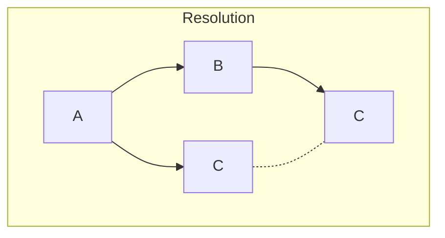
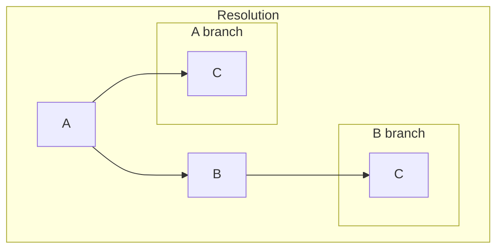
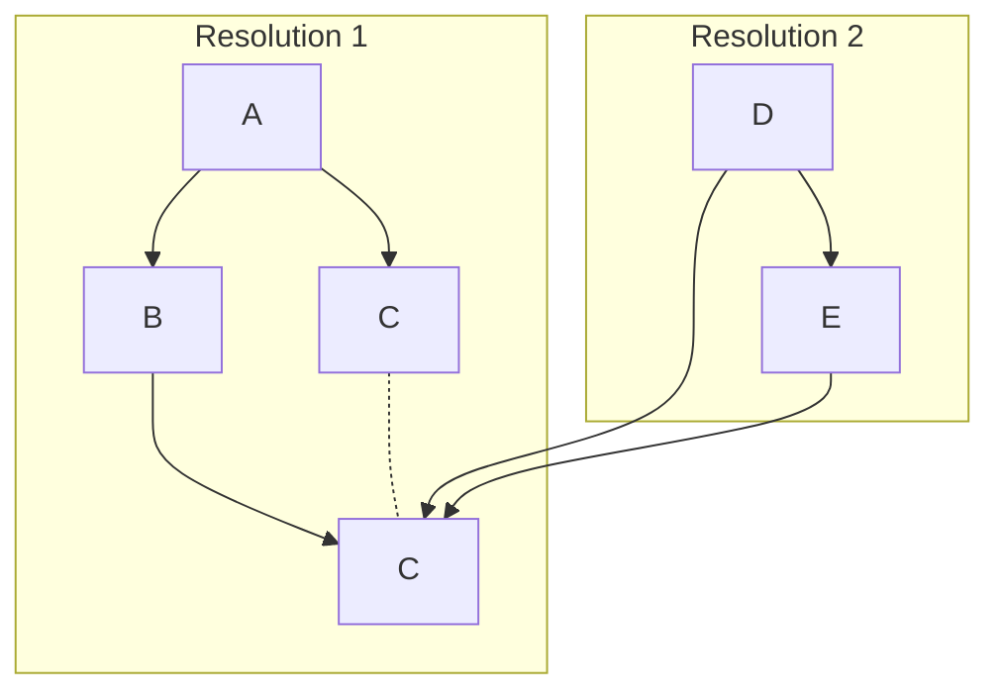

# Scopes

**Scopes** are important. They are the way you can control the extent of what is being resolved and how everthing gets shared across your application.

In Wox Inject there's a few concepts that you need to understand before jumping into Scopes, else you'll be flooded with unexpected behaviors. The first concept is the **Injectable Fragment**. This is the _thing_ that you want to resolve in your application. It can be a service, a controller, a view-model, or whatever design pattern satisfies your needs.

Next up is the **Container**. This is where the Injectable Fragment is stored and resolved. The Container is the place where the Injectable Fragment is created and stored. It's also the place where the Injectable Fragment is resolved from. Containers are primarily a result of the way your React application is structured. By default your application will have a **Root Container** (the root container), but you can also create your own Containers (local containers) to control the extent of what is being resolved vertically in your application.

Lastly, there's the **Resolution**. This is the process of getting the Injectable Fragment from a Container. This is done by either passing the Injectable Fragment as a parameter to a constructor or by using the `useResolve` hook in a React component. So when the text says "resolve the Injectable Fragment", it means to get the **Injectable Fragment** from a **Container** using **Resolution.**

With that out of the way, let's now talk about Scopes. Within a Resolution, different Scopes is used to control in which Container the Injectable Fragment is stored to. There's three types of Scopes in Wox Inject, these are: `Scoped`, `Transient` and `Singleton`. Each of them provides a different way to resolve your services.

To mark a Injectable Fragment with a Scope, you can use the `@Injectable` decorator with the `scope` option. The `scope` option can be set to either `scoped`, `transient` or `singleton`.

Here's a quick overview of the different Scopes:

#### Scoped
Scoped is the default and these are resolved once per Resolution. This means it'll only be resolved once even though a Resolution may contain multiple of itself.



In the example above, `C` has its Scope set to Scoped and is appearing twice in the Resolution. It's only resolved once, so one instance of `C` is shared between `A` and `B`. It'll also be possible to resolve the same instance of `C` in other Resolutions as long as they are within the same Container branch.

##### Declaring a Scoped Injectable Fragment

```tsx
@Injectable()
class C {
  // ...
}

// or

@Injectable({ scope: 'scoped' })
class C {
  // ...
}
```

#### Transient
Transient is resolved every time it's requested. This means that every time you request the Injetable Fragment, a new instance of it will be created.



In the example above, `C` has its Scope set to Transient and is appearing twice in the Resolution. It's resolved on each occurence, so `A` and `B` will have their own instance of `C`. It will is not possible to create two identical instances of `C`, they will always be unique.

##### Declaring a Transient Injectable Fragment

```tsx
@Injectable({ scope: 'transient' })
class C {
  // ...
}
```

#### Singleton
Singleton is resolved once and put into the Global Cointainer. This means that the same instance will be returned every time it's requested, even though multiple Containers are created.



In the example above, `C` has its Scope set to Singleton and is appearing twice in the Resolution. It's always resolved once, so `A` and `B` will have their own instance of `C`. And if `C` where to be resolved in another Resolutaion that lies beneath the its origin Container, it would still return the same instance of `C`.

##### Declaring a Singleton Injectable Fragment

```tsx
@Injectable({ scope: 'singleton' })
class C {
  // ...
}
```
